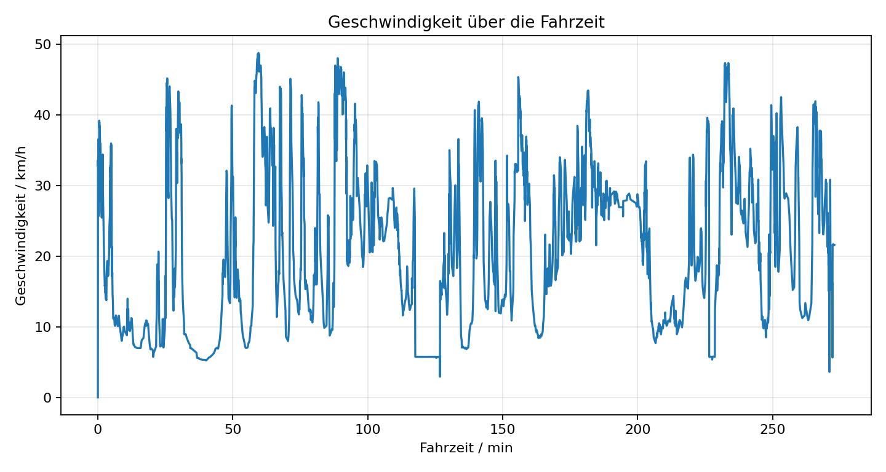
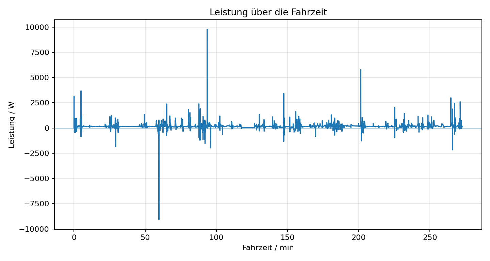
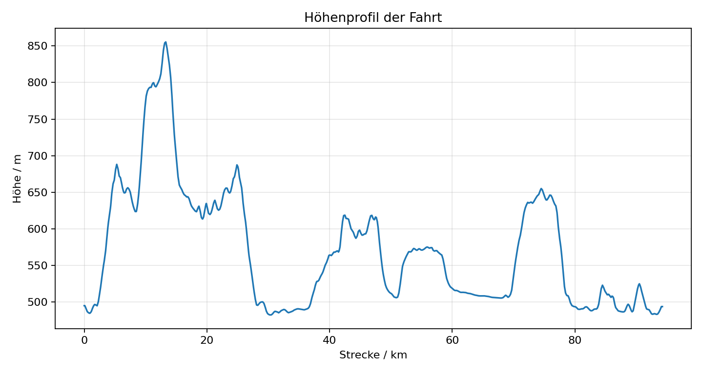
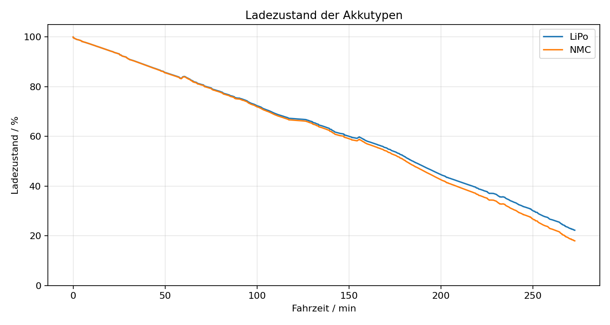
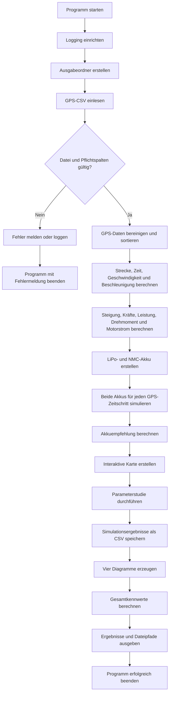
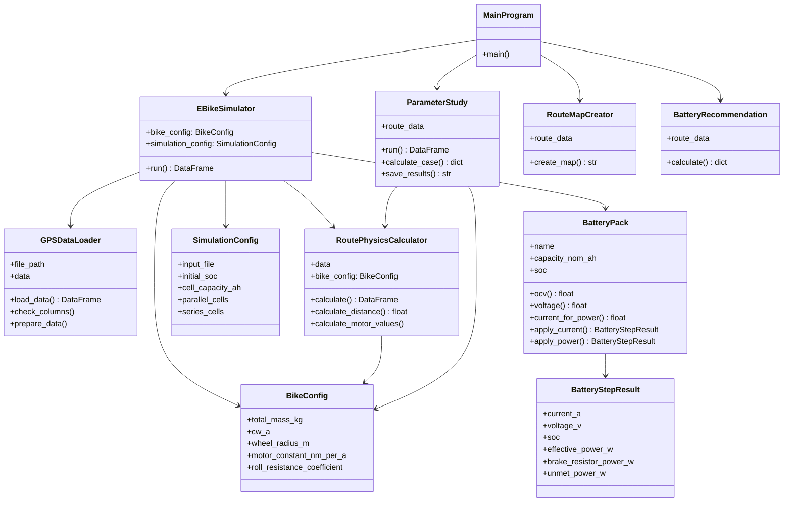

# E-Bike-Abschlussprojekt

Python-Anwendung zur Auslegung und Simulation eines E-Bikes anhand realer GPS-Daten.

Die Anwendung liest eine aufgezeichnete Route aus einer CSV-Datei ein und berechnet daraus unter anderem Strecke, Geschwindigkeit, Beschleunigung, Steigung, Antriebskraft, Leistung, Motordrehmoment und Motorstrom. Anschließend wird die Fahrt mit zwei unterschiedlichen Akkutypen simuliert und der Ladezustand über die gesamte Fahrt ausgewertet.

## Projektmitglieder

- Lukas Brugger
- Luca Tiefenthaler

## Erfüllung der Minimalanforderungen

| Minimalanforderung | Umsetzung |
|---|---|
| Python-Softwareprojekt mit Objektorientierung | Klassen für Simulation, Datenimport, Physik, Akku, Karte, Parameterstudie und Akkuempfehlung |
| Versionskontrolle mit Git und GitHub | Repository mit inhaltlichen Commits beider Projektmitglieder |
| GPS-Daten einlesen und auswerten | `GPSDataLoader` und `RoutePhysicsCalculator` |
| Geschwindigkeit und Beschleunigung | Berechnung für jeden GPS-Abschnitt |
| Leistung und Steigung | Berechnung aus Geschwindigkeit, Beschleunigung und Höhendaten |
| Drehmoment und Motorstrom | Berechnung mit Radhalbmesser und Motorkonstante |
| Durchschnittsgeschwindigkeit | Ausgabe in `main.py` |
| Zurückgelegte Strecke | Ausgabe in `main.py` |
| Benötigte Zeit | Ausgabe in Minuten |
| Höhenmeter Anstieg und Abstieg | Summe der positiven und negativen Höhenänderungen |
| Maximalleistung | Ausgabe in Watt |
| Zwei unterschiedliche Akkutypen | LiPo und NMC mit verschiedenen OCV-Kennlinien und Innenwiderständen |
| Ladezustand über die Fahrt | Simulation für jeden GPS-Zeitschritt |
| Ladezustand auf 0 bis 100 % begrenzen | Begrenzung im Akkumodell mit `numpy.clip` |
| Grafische Darstellung | Geschwindigkeit, Leistung, Ladezustand und Höhenprofil |
| Logging und Fehlerbehandlung | Logdatei, Datenprüfung, Parameterprüfung und Akku-Grenzen |
| Aktivitätsdiagramm | In dieser README enthalten |
| UML-Diagramm | In dieser README enthalten |
| `requirements.txt` | Enthält alle benötigten externen Pakete |
| Installations- und Startanleitung | In dieser README enthalten |

## Voraussetzungen

- Python **3.10 oder neuer**
- Terminal, PowerShell oder eine Entwicklungsumgebung wie Visual Studio Code

Die Anwendung muss aus dem Hauptordner gestartet werden, in dem sich `main.py` befindet.

## Installation unter Windows

Projektordner in PowerShell öffnen und eine virtuelle Umgebung erstellen:

```powershell
python -m venv .venv
```

Virtuelle Umgebung aktivieren:

```powershell
.venv\Scripts\activate
```

Benötigte Pakete installieren:

```powershell
python -m pip install -r requirements.txt
```

## Installation unter macOS oder Linux

Projektordner im Terminal öffnen und eine virtuelle Umgebung erstellen:

```bash
python3 -m venv .venv
```

Virtuelle Umgebung aktivieren:

```bash
source .venv/bin/activate
```

Benötigte Pakete installieren:

```bash
python3 -m pip install -r requirements.txt
```

## Programm starten

Unter Windows:

```powershell
python main.py
```

Unter macOS oder Linux:

```bash
python3 main.py
```

Nach einem erfolgreichen Durchlauf werden die Fahrdaten im Terminal ausgegeben und die Ergebnisdateien in den Unterordnern von `output/` gespeichert.

## Tests starten

Unter Windows:

```powershell
python -m pytest
```

Unter macOS oder Linux:

```bash
python3 -m pytest
```

Aktueller Teststand:

```text
4 passed
```

Die vorhandenen Unit-Tests prüfen wichtige Funktionen des Akkumodells:

- Entladen senkt den Ladezustand.
- Laden erhöht den Ladezustand und begrenzt ihn auf 100 %.
- Positive Leistung erzeugt einen positiven Strom.
- Negative Leistung erzeugt einen negativen Strom.

## Eingangsdaten

Die GPS-Daten befinden sich in:

```text
data/final_project_input_data.csv
```

Benötigte Spalten:

| Spalte | Bedeutung |
|---|---|
| `lat` | Breitengrad |
| `lon` | Längengrad |
| `ele` | Höhe über dem Meeresspiegel in Metern |
| `time` | Zeitstempel des GPS-Punktes |

Die CSV-Datei wird mit einem Semikolon als Trennzeichen eingelesen. Ungültige Zeilen werden entfernt und die Daten werden nach dem Zeitstempel sortiert.

## Berechnete Größen

Die Anwendung berechnet für jeden Streckenabschnitt:

- Entfernung zwischen zwei GPS-Punkten
- kumulierte Gesamtstrecke
- Zeitdifferenz
- Geschwindigkeit
- Beschleunigung
- Höhenänderung
- Steigung in Prozent und Radiant
- gesamte Antriebskraft
- mechanische Leistung
- Motordrehmoment
- Motorstrom
- Spannung, Strom und Ladezustand des LiPo-Akkus
- Spannung, Strom und Ladezustand des NMC-Akkus

Zusätzlich werden für die gesamte Fahrt folgende Kennwerte ausgegeben:

- Anzahl der GPS-Punkte
- zurückgelegte Strecke
- Fahrtdauer
- Durchschnittsgeschwindigkeit
- Höhenmeter Anstieg und Abstieg
- maximale Geschwindigkeit
- maximale Beschleunigung
- maximale Steigung
- maximale Leistung
- maximales Drehmoment
- maximaler Motorstrom
- Ladezustand beider Akkus am Ende der Fahrt
- empfohlene Akkukapazität mit 20 % Energiereserve

## Aktuelle Simulationsergebnisse

Ergebnis des geprüften Programmlaufs mit dem bereitgestellten Datensatz:

| Kennwert | Ergebnis |
|---|---:|
| GPS-Datenpunkte | 2.284 |
| Strecke | 94,27 km |
| Fahrtdauer | 272,87 min |
| Durchschnittsgeschwindigkeit | 20,73 km/h |
| Höhenmeter Anstieg | 1.095,90 m |
| Höhenmeter Abstieg | 1.097,15 m |
| Maximale Geschwindigkeit | 48,77 km/h |
| Maximale Beschleunigung | 14,99 m/s² |
| Maximale Steigung | 13,39 % |
| Maximale Leistung | 9.784,35 W |
| Maximales Drehmoment | 423,24 Nm |
| Maximaler Motorstrom | 282,16 A |
| LiPo-Ladezustand am Ende | 22,26 % |
| NMC-Ladezustand am Ende | 17,99 % |
| Berechneter Energiebedarf | 787,66 Wh |
| Empfohlene Energie mit 20 % Reserve | 945,19 Wh |
| Empfohlene Akkukapazität bei 37 V | 25,55 Ah |

Die hohen kurzzeitigen Spitzen bei Beschleunigung, Leistung, Drehmoment und Strom entstehen durch die direkte Ableitung der ungeglätteten GPS-Daten. Sie werden transparent ausgegeben und sind eine bekannte Grenze des vereinfachten Modells.

## Grafische Ausgaben

## Geschwindigkeitsverlauf

<p align="center">
  
</p>

## Leistungsverlauf

<p align="center">
  
</p>

## Höhenprofil

<p align="center">
  
</p>

## Akkuvergleich

<p align="center">
  
</p>

## Ausgabedateien

| Datei | Inhalt |
|---|---|
| `output/results/simulation_results.csv` | GPS-Daten und alle berechneten Simulationswerte |
| `output/results/parameter_study.csv` | Ergebnisse der automatischen Parameterstudie |
| `output/plots/speed_over_time.png` | Geschwindigkeit über die Fahrzeit |
| `output/plots/power_over_time.png` | Leistung über die Fahrzeit |
| `output/plots/elevation_profile.png` | Höhe über die zurückgelegte Strecke |
| `output/plots/soc_comparison.png` | Vergleich der Ladezustände von LiPo und NMC |
| `output/maps/route_map.html` | Interaktive Karte der GPS-Route |
| `logs/simulation.log` | Protokoll des Programmablaufs |

Die interaktive Karte kann lokal im Browser geöffnet werden:

```text
output/maps/route_map.html
```

## Projektstruktur

```text
Abschlussprojekt-Brugger-Tiefenthaler/
├── data/
│   └── final_project_input_data.csv
├── docs/
│   └── Abschlussprojekt.pdf
├── ebike_sim/
│   ├── __init__.py
│   ├── battery.py
│   ├── battery_recommendation.py
│   ├── config.py
│   ├── data_loader.py
│   ├── logging_config.py
│   ├── parameter_study.py
│   ├── physics.py
│   ├── plotting.py
│   ├── route_map.py
│   └── simulator.py
├── output/
│   ├── maps/
│   ├── plots/
│   └── results/
├── tests/
│   └── test_battery.py
├── .gitignore
├── main.py
├── README.md
└── requirements.txt
```


## Physikalisches Modell

### Entfernung mit der Haversine-Formel

Die Entfernung zwischen zwei GPS-Punkten wird auf einer kugelförmig angenäherten Erde mit einem Erdradius von 6.371.000 m berechnet.

### Geschwindigkeit und Beschleunigung

```text
v = Δs / Δt
a = Δv / Δt
```

### Steigung

```text
Steigung [%] = (Δh / Δs) · 100
φ = arctan(Δh / Δs)
```

### Kräfte

```text
F_Beschleunigung = m · a
F_Steigung       = m · g · sin(φ)
F_Roll           = m · g · c_roll · cos(φ)
F_Luft           = 0,5 · ρ · cwA · v²
F_gesamt         = F_Beschleunigung + F_Steigung + F_Roll + F_Luft
```

### Leistung, Drehmoment und Motorstrom

```text
P = F_gesamt · v
T = F_gesamt · r
I_Motor = T / K_m
```

### Änderung des Ladezustands

```text
SOC_neu = SOC_alt - I · Δt / (C_Ah · 3600)
```

Der Ladezustand wird nach jedem Rechenschritt auf den gültigen Bereich von 0 bis 1 beziehungsweise 0 bis 100 % begrenzt.

## Annahmen und Parameter

### Fahrrad und Fahrer

| Parameter | Wert | Herkunft |
|---|---:|---|
| Masse Fahrer | 70 kg | Aufgabenstellung |
| Masse Fahrrad | 10 kg | Aufgabenstellung |
| Gesamtmasse | 80 kg | Summe aus Fahrer und Fahrrad |
| Produkt aus Luftwiderstandsbeiwert und Stirnfläche `cwA` | 0,5625 m² | Aufgabenstellung |
| Raddurchmesser | 27 Zoll | Aufgabenstellung |
| Motorkonstante | 1,5 Nm/A | Aufgabenstellung |
| Erdbeschleunigung | 9,81 m/s² | Standardwert |
| Luftdichte | 1,225 kg/m³ | Annahme für Luft unter Standardbedingungen |
| Rollwiderstandskoeffizient | 0,008 | Modellannahme |

Das Modell nimmt einen direkt angetriebenen Radnabenmotor ohne Getriebe an.

### Akkus

Beide Akkus werden als 10S8P-Paket mit 3 Ah Zellkapazität modelliert. Dadurch ergibt sich eine nominelle Kapazität von 24 Ah.

| Eigenschaft | LiPo | NMC |
|---|---:|---:|
| Verschaltung | 10S8P | 10S8P |
| Zellkapazität | 3 Ah | 3 Ah |
| Nennspannung pro Zelle | 3,7 V | 3,7 V |
| Minimale Spannung pro Zelle | 3,2 V | 3,2 V |
| Maximale Spannung pro Zelle | 4,2 V | 4,2 V |
| Innenwiderstand pro Zelle | 8 mΩ | 7 mΩ |
| Anfangsladezustand | 100 % | 100 % |

Die beiden Akkutypen unterscheiden sich zusätzlich durch ihre in `battery.py` hinterlegten OCV-SOC-Kennlinien.

## Logging und Fehlerbehandlung

Die Anwendung enthält folgende Schutzmaßnahmen:

- Eine fehlende GPS-Datei wird geloggt und löst einen `FileNotFoundError` aus.
- Fehlende Pflichtspalten lösen einen `ValueError` aus.
- Ungültige GPS-Zeilen werden entfernt.
- Bei nichtpositiven Zeitabständen werden Geschwindigkeit und Beschleunigung auf 0 gesetzt.
- Ungültige Akkukapazitäten und Innenwiderstände werden abgewiesen.
- Negative Simulationszeiten lösen einen `ValueError` aus.
- Lade- und Entladeströme werden auf erlaubte Grenzwerte begrenzt.
- Der Ladezustand wird immer auf 0 bis 100 % begrenzt.
- Wichtige Programmschritte werden in `logs/simulation.log` protokolliert.

## Aktivitätsdiagramm



## UML-Klassendiagramm



## Umgesetzte Erweiterungen

Über die Minimalanforderungen hinaus wurden folgende Erweiterungen umgesetzt:

- interaktive GPS-Karte mit Folium
- automatische Parameterstudie für Masse, `cwA`, Rollwiderstand und Raddurchmesser
- Akkuempfehlung mit 20 % Energiereserve
- Unit-Tests für das Akkumodell
- Rollwiderstand im physikalischen Modell
- Akkumodell mit Stromgrenzen, Innenwiderstand und möglichen Verlustleistungen
- Conventional Commits für nachvollziehbaren Versionsverlauf

## Bekannte Modellgrenzen

- GPS- und Höhendaten werden derzeit nicht geglättet. Dadurch können kurze Spitzen in Beschleunigung und Leistung entstehen.
- Das vereinfachte Modell verwendet keinen eigenen Motor- oder Antriebswirkungsgrad.
- Wind, Straßenbelag und dynamische Änderungen der Luftdichte werden nicht berücksichtigt.
- Die Akkutemperatur wird nicht dynamisch über die Fahrt berechnet.
- Die Akkuempfehlung basiert auf dem positiven mechanischen Energiebedarf und einer pauschalen Reserve von 20 %.

Diese Punkte verhindern nicht die Erfüllung der Minimalanforderungen, zeigen aber mögliche weitere Verbesserungen des Modells.

## Quellen

- MCI, *Abschlussprojekt SS 2026*, bereitgestellte Projektunterlage in `docs/Abschlussprojekt.pdf`: Aufgabenstellung, Fahrradparameter, vereinfachtes Antriebsmodell sowie LiPo- und NMC-Kennlinien.
- Sinnott, R. W. (1984), *Virtues of the Haversine*, Sky & Telescope, Vol. 68, No. 2: Haversine-Formel zur Distanzberechnung aus geografischen Koordinaten.
- Dokumentationen der eingesetzten Python-Pakete: pandas, NumPy, Matplotlib, Folium und pytest.
