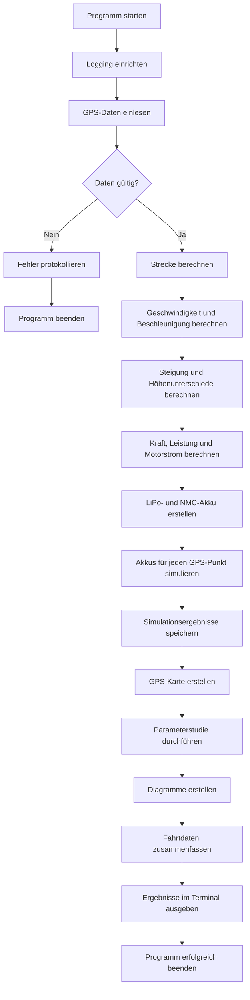
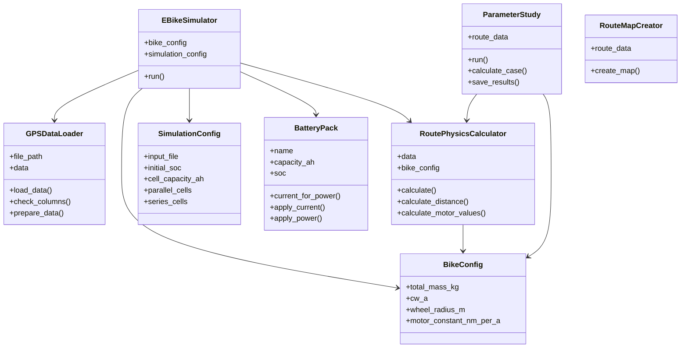

# E-Bike-Abschlussprojekt

Python-Anwendung zur Auslegung und Simulation eines E-Bikes anhand von GPS-Daten.

Das Programm liest eine aufgezeichnete Route aus einer CSV-Datei ein. Anschließend werden wichtige Werte wie Strecke, Geschwindigkeit, Beschleunigung, Steigung, Leistung, Drehmoment und Motorstrom berechnet.

Zusätzlich wird der Ladezustand von zwei verschiedenen Akkutypen simuliert:

LiPo-Akku
NMC-Akku

## Projektmitglieder

Brugger
Tiefenthaler

## Voraussetzungen

Für das Projekt wird Python 3 benötigt.

Die benötigten Python-Pakete stehen in der Datei `requirements.txt`.

## Installation unter Windows

Zuerst den Projektordner im Terminal öffnen.

Eine virtuelle Python-Umgebung erstellen:

python -m venv .venv

Die virtuelle Umgebung aktivieren:

.venv\Scripts\activate

Die benötigten Pakete installieren:

python -m pip install -r requirements.txt

## Installation unter macOS oder Linux

Zuerst den Projektordner im Terminal öffnen.

Eine virtuelle Python-Umgebung erstellen:

python3 -m venv .venv

Die virtuelle Umgebung aktivieren:

source .venv/bin/activate

Die benötigten Pakete installieren:

python3 -m pip install -r requirements.txt

## Programm starten

Unter Windows:

python main.py

Unter macOS oder Linux:

python3 main.py

## Tests starten

Unter Windows:

python -m pytest

Unter macOS oder Linux:

python3 -m pytest

Wenn alle bisherigen Tests erfolgreich sind, sollte ungefähr folgende Meldung erscheinen:

4 passed

## Eingangsdaten

Die GPS-Daten befinden sich in dieser Datei:

data/final_project_input_data.csv

Die Datei enthält unter anderem:

Zeitstempel
Breitengrad
Längengrad
Höhe
Temperatur

## Berechnete Werte

Das Programm berechnet momentan:

Entfernung zwischen zwei GPS-Punkten
gesamte Strecke
Geschwindigkeit
Beschleunigung
Steigung
benötigte Kraft
mechanische Leistung
Drehmoment
Motorstrom
Ladezustand eines LiPo-Akkus
Ladezustand eines NMC-Akkus

## Ausgabedateien

Nach dem Programmstart wird diese Ergebnisdatei erstellt:

output/results/simulation_results.csv

Die Datei enthält die ursprünglichen GPS-Daten und die zusätzlich berechneten Werte.

Außerdem wird eine Logdatei erstellt:

logs/simulation.log

In der Logdatei werden wichtige Programmschritte und mögliche Fehler gespeichert.

## Projektstruktur

Abschlussprojekt-Brugger-Tiefenthaler/
├── data/
│   └── final_project_input_data.csv
├── docs/
│   └── Abschlussprojekt.pdf
├── ebike_sim/
│   ├── battery.py
│   ├── config.py
│   ├── data_loader.py
│   ├── logging_config.py
│   ├── physics.py
│   ├── plotting.py
│   └── simulator.py
├── tests/
│   └── test_battery.py
├── main.py
├── README.md
└── requirements.txt

## Bedeutung der wichtigsten Dateien

### main.py

Startet das gesamte Programm und gibt die wichtigsten Ergebnisse im Terminal aus.

### data_loader.py

Liest die GPS-Daten aus der CSV-Datei ein und prüft die benötigten Spalten.

### physics.py

Berechnet die Strecke sowie die physikalischen Größen des E-Bikes.

### battery.py

Enthält die objektorientierten Akkumodelle für LiPo und NMC.

### simulator.py

Verbindet den Datenimport, die physikalischen Berechnungen und die Akkusimulation.

### plotting.py

Wird für die Erstellung der Diagramme verwendet.

### logging_config.py

Richtet die Protokollierung des Programmablaufs ein.

## Aktueller Projektstand

Die grundlegende E-Bike-Simulation ist funktionsfähig.

Folgende Funktionen sind umgesetzt:

- Einlesen und Prüfen der GPS-Daten
- Berechnung der zurückgelegten Strecke
- Berechnung von Geschwindigkeit und Beschleunigung
- Berechnung von Steigung und Höhenmetern
- Berechnung von Kraft, Leistung und Drehmoment
- Berechnung des Motorstroms
- Simulation eines LiPo-Akkus
- Simulation eines NMC-Akkus
- Darstellung des Ladezustands über die Fahrt
- Ausgabe der wichtigsten Fahrdaten
- Erstellung von vier Diagrammen
- Darstellung der GPS-Route auf einer Karte
- Durchführung einer Parameterstudie
- Speicherung der Ergebnisse als CSV-Dateien
- Logging des Programmablaufs
- automatische Tests für die Akkumodelle

## Aktivitätsdiagramm

Das Aktivitätsdiagramm zeigt den gesamten Ablauf des Programms.

## UML-Klassendiagramm

Das Klassendiagramm zeigt die wichtigsten Klassen und ihre Beziehungen.

